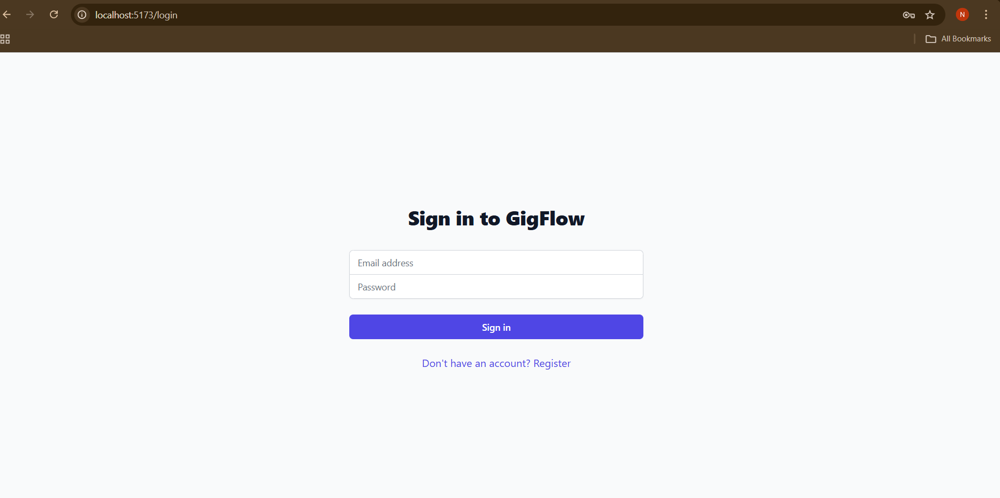
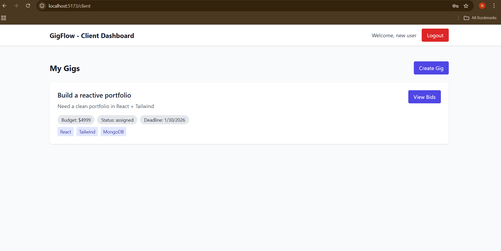
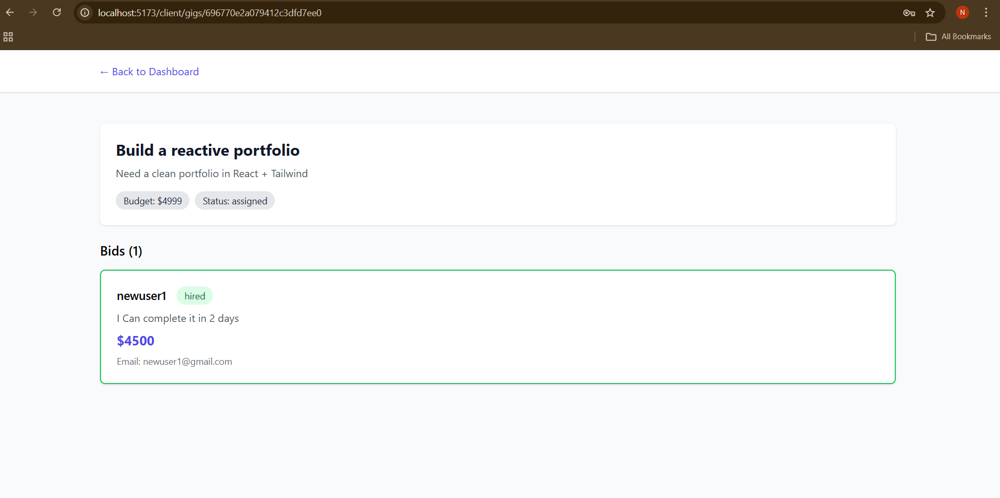
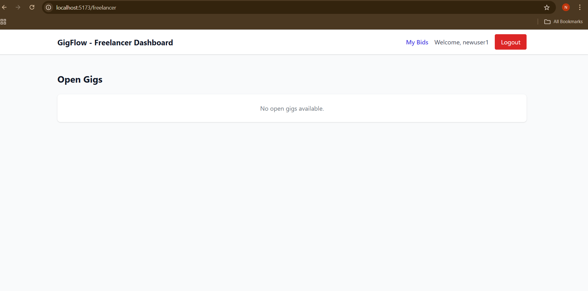
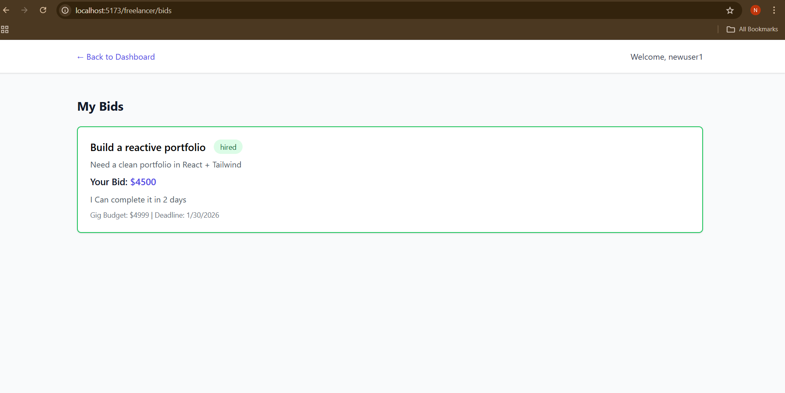
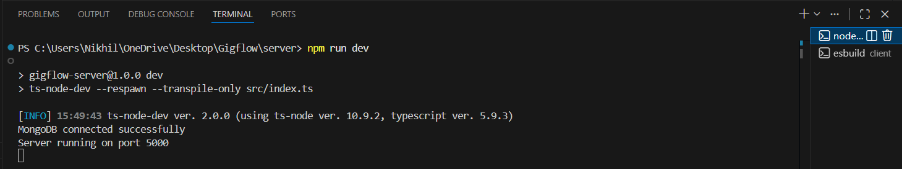
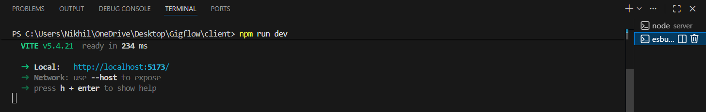

# GigFlow MVP

A full-stack freelancing platform MVP built with React, Node.js, Express, and MongoDB.

## Tech Stack

### Frontend
- React 18 with TypeScript
- Vite for build tooling
- Tailwind CSS for styling
- Redux Toolkit for state management
- React Router for navigation
- Axios for API calls

### Backend
- Node.js with Express
- TypeScript
- MongoDB with Mongoose
- JWT authentication (HttpOnly cookies)
- MongoDB transactions for atomic operations

## Features

### Authentication
- User registration (Client or Freelancer role)
- Login/Logout
- JWT-based authentication with HttpOnly cookies
- Protected routes based on user role

### Client Features
- Create gigs (title, description, budget, deadline, skills)
- View own gigs
- View bids on gigs
- Hire freelancers (atomic transaction)

### Freelancer Features
- Browse open gigs
- Place bids on gigs
- View own bids
- Prevent duplicate bids on same gig

### Business Rules
- Freelancers cannot bid twice on the same gig (unique index)
- No bids accepted after gig is assigned
- Clients can only hire on their own gigs
- Atomic hire operation prevents race conditions using MongoDB transactions
## Screenshots
Below are the sample UI screens from the working MVP.
### 1) Login Page


### 2) Client Dashboard


### 3) Client - View Bids


### 4) Freelancer Dashboard


### 5) Freelancer - My Bids


### 6) Backend Running


### 7) Frontend Running


## Setup Instructions

### Prerequisites
- Node.js (v18 or higher)
- MongoDB (local installation or MongoDB Atlas connection string)
- npm or yarn

### Backend Setup

1. Navigate to the server directory:
```bash
cd server
```

2. Install dependencies:
```bash
npm install
```

3. Create a `.env` file in the `server` directory:
```env
PORT=5000
MONGODB_URI=mongodb://localhost:27017/gigflow
JWT_SECRET=your-super-secret-jwt-key-change-this-in-production
NODE_ENV=development
CLIENT_URL=http://localhost:5173
```

4. Start MongoDB (if running locally):
```bash
# On macOS with Homebrew
brew services start mongodb-community

# On Windows
# Start MongoDB service from Services panel or use mongod command

# On Linux
sudo systemctl start mongod
```

5. Run the backend server:
```bash
# Development mode (with auto-reload)
npm run dev

# Production mode
npm run build
npm start
```

The backend server will run on `http://localhost:5000`

### Frontend Setup

1. Navigate to the client directory:
```bash
cd client
```

2. Install dependencies:
```bash
npm install
```

3. Start the development server:
```bash
npm run dev
```

The frontend will run on `http://localhost:5173`

### Running Tests

From the `server` directory:
```bash
npm test
```

Tests include:
- Login success/failure scenarios
- Duplicate bid prevention
- Atomic hire concurrency test (ensures only one hire succeeds)

## Project Structure

```
GigFlow/
├── server/
│   ├── src/
│   │   ├── controllers/     # Request handlers
│   │   │   ├── authController.ts
│   │   │   ├── gigController.ts
│   │   │   └── bidController.ts
│   │   ├── models/          # Mongoose models
│   │   │   ├── User.ts
│   │   │   ├── Gig.ts
│   │   │   └── Bid.ts
│   │   ├── routes/          # Express routes
│   │   │   ├── authRoutes.ts
│   │   │   ├── gigRoutes.ts
│   │   │   └── bidRoutes.ts
│   │   ├── middleware/      # Express middleware
│   │   │   ├── auth.ts
│   │   │   └── errorHandler.ts
│   │   ├── utils/           # Utility functions
│   │   │   ├── db.ts
│   │   │   └── jwt.ts
│   │   ├── tests/           # Test files
│   │   │   ├── auth.test.ts
│   │   │   ├── bid.test.ts
│   │   │   ├── hire.test.ts
│   │   │   └── setup.ts
│   │   └── index.ts         # Entry point
│   ├── package.json
│   ├── tsconfig.json
│   └── jest.config.js
│
├── client/
│   ├── src/
│   │   ├── pages/           # React page components
│   │   │   ├── Login.tsx
│   │   │   ├── Register.tsx
│   │   │   ├── ClientDashboard.tsx
│   │   │   ├── ClientGigBids.tsx
│   │   │   ├── FreelancerDashboard.tsx
│   │   │   ├── FreelancerGigBid.tsx
│   │   │   └── FreelancerBids.tsx
│   │   ├── store/           # Redux store
│   │   │   ├── store.ts
│   │   │   ├── slices/
│   │   │   │   └── authSlice.ts
│   │   │   └── hooks.ts
│   │   ├── lib/             # API client
│   │   │   └── api.ts
│   │   ├── App.tsx
│   │   ├── main.tsx
│   │   └── index.css
│   ├── package.json
│   ├── vite.config.ts
│   ├── tailwind.config.js
│   └── tsconfig.json
│
└── README.md
```

## API Endpoints

### Authentication
- `POST /api/auth/register` - Register new user
- `POST /api/auth/login` - Login user
- `POST /api/auth/logout` - Logout user
- `GET /api/auth/me` - Get current user

### Gigs (Client)
- `POST /api/gigs` - Create new gig
- `GET /api/gigs/mine` - Get client's gigs
- `GET /api/gigs/:gigId/bids` - Get bids for a gig
- `POST /api/gigs/:gigId/hire/:bidId` - Hire freelancer (atomic)

### Gigs (Freelancer)
- `GET /api/gigs/open` - Get open gigs

### Bids (Freelancer)
- `POST /api/gigs/:gigId/bids` - Create bid on gig
- `GET /api/bids/mine` - Get freelancer's bids

## Environment Variables

### Backend (.env)
- `PORT` - Server port (default: 5000)
- `MONGODB_URI` - MongoDB connection string
- `JWT_SECRET` - Secret key for JWT tokens
- `NODE_ENV` - Environment (development/production)
- `CLIENT_URL` - Frontend URL for CORS (default: http://localhost:5173)

## Development

### Backend Development
- Uses `ts-node-dev` for hot reloading
- TypeScript strict mode enabled
- ESLint recommended (add if needed)

### Frontend Development
- Vite HMR (Hot Module Replacement)
- Proxy configured for API calls
- Tailwind CSS JIT compilation

## Production Build

### Backend
```bash
cd server
npm run build
npm start
```

### Frontend
```bash
cd client
npm run build
# Serve dist/ folder with a static file server
```

## Testing

The backend includes tests for:
1. Authentication (login success/failure)
2. Duplicate bid prevention
3. Atomic hire concurrency (race condition safety)

Run tests:
```bash
cd server
npm test
```

## Notes

- JWT tokens are stored in HttpOnly cookies for security
- MongoDB transactions ensure atomic hire operations
- Unique index on (gigId, freelancerId) prevents duplicate bids
- All routes are protected with authentication middleware
- Role-based authorization enforced on all endpoints

## License

ISC
